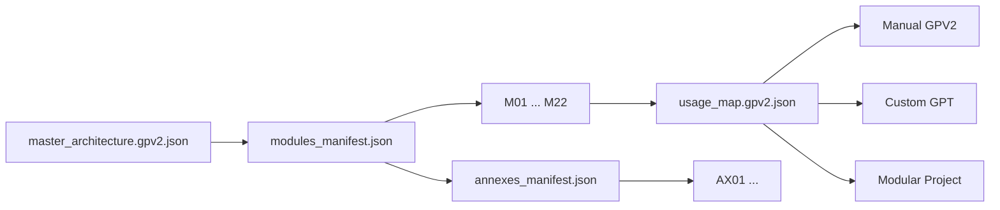

# ora-core-os

Main public entry point for ORA Core OS.

This repository contains the canonical ORA Core OS architecture in `GPV2`: 22 core modules, one install order, public specifications, and optional annex extensions.

## Start Here First

If you are new to the ORA Core ecosystem, start with the learning path:

- [ORA Core Learning Path](docs/ORA_CORE_LEARNING_PATH.md)

This page gives the recommended reading order across GrenaPrompt, FGP, GPV2, Rosetta, Essences, Runtime and RAG.

## Repository Role

Start here when you want to understand the ORA Core architecture before reading runtime code or module-specific repositories.

| Public order | Repository role |
| ---: | --- |
| 1 | Canonical ORA Core OS architecture and installation map. |

## Concept Map

```text
GrenaPrompt        = human-machine prompt language
FGP                = governance around GrenaPrompt
GPV2               = compact governed execution packet
Gibberlink         = compact symbolic state language
Gibberlink_Glyph   = optional glyph / phonetic bridge
GLK                = canonical archive and retrieval key
Rosetta Translator = backend translation / compilation / validation layer
ORA Essences       = compressed behavioral micro-modules
Runtime            = executable bootstrap and tests
RAG                = retrieval and memory context layer
```

## GPV2 Foundation

GPV2 is the compact, structured, routable and governed form of GP.

- [GPV2 Foundational Note](docs/GPV2_FOUNDATIONAL_NOTE.md)

Core foundation:

```text
GP = readable hybrid instruction
GPV2 = compact governed execution packet
GPV2 = GP without superfluous noise, but with structure, order, routing, truth and audit
```

## Why This Repository Exists

`ora-core-os` is published to make the architecture:

- readable
- installable
- modular
- verifiable

This repo is for people who want a clear source of truth for:

- core module order
- dependency wiring
- public install paths
- output and truth constraints
- optional annex extensions that do not break the 22-core base

## What You Get

- a public specification
- a master white paper
- a public learning path
- a GPV2 foundational note
- a single-file GPV2 core reference
- one GPV2 file per core module
- optional annex modules for targeted extensions
- a manual installation guide
- a Custom GPT installation guide
- a quickstart for first evaluation

## Recommended Reading Order

1. [ORA Core Learning Path](docs/ORA_CORE_LEARNING_PATH.md)
2. [Quickstart](docs/QUICKSTART.md)
3. [GPV2 Foundational Note](docs/GPV2_FOUNDATIONAL_NOTE.md)
4. [GPV2 Index](docs/GPV2/README.md)
5. [Master White Paper](docs/ORA_CORE_OS_Master_WhitePaper.md)
6. [Modular Architecture and ORA RAG White Paper](https://github.com/TwinsProductionAI/ora-core-specs/tree/main/specs/modular-architecture)
7. [Public Spec](docs/ORA_CORE_OS_PUBLIC_SPEC.md)
8. [Manual Install](docs/INSTALL_MANUAL_GPV2.md)
9. [Custom GPT Install](docs/INSTALL_CUSTOM_GPT.md)

## Choose Your Path

| Path | Use it when | Start file |
| --- | --- | --- |
| Public learning path | You want the cleanest reading order across all ORA repos | [docs/ORA_CORE_LEARNING_PATH.md](docs/ORA_CORE_LEARNING_PATH.md) |
| Quick evaluation | You want to understand the repo in a few minutes | [docs/QUICKSTART.md](docs/QUICKSTART.md) |
| GPV2 foundation | You want the simple GP to GPV2 definition before the architecture | [docs/GPV2_FOUNDATIONAL_NOTE.md](docs/GPV2_FOUNDATIONAL_NOTE.md) |
| Strategic/technical overview | You want the full public architecture narrative | [docs/ORA_CORE_OS_Master_WhitePaper.md](docs/ORA_CORE_OS_Master_WhitePaper.md) |
| Modular architecture and RAG overview | You want the cross-layer architecture of ORA Core OS and ORA RAG | [ora-core-specs/specs/modular-architecture](https://github.com/TwinsProductionAI/ora-core-specs/tree/main/specs/modular-architecture) |
| Manual GPV2 install | You want full control over files and wiring | [docs/INSTALL_MANUAL_GPV2.md](docs/INSTALL_MANUAL_GPV2.md) |
| Custom GPT install | You want to port the architecture into ChatGPT | [docs/INSTALL_CUSTOM_GPT.md](docs/INSTALL_CUSTOM_GPT.md) |
| Modular inspection | You want to inspect each core module separately | [docs/GPV2/modules/README.md](docs/GPV2/modules/README.md) |
| Optional extensions | You want add-on modules without changing the 22-core base | [docs/GPV2/annexes/README.md](docs/GPV2/annexes/README.md) |

## Architecture Flow



## Architecture At A Glance

Section groups:

- `S1` orchestration and governance
- `S2` positioning and signal shaping
- `S3` memory and learning
- `S4` production pipeline

Core rules:

- `CODE_POS` is the canonical install order for the 22 core modules
- `DEPENDS_ON` defines required upstream links
- `GPV2` is the structural source of truth
- `NATIVE_FINAL` must not add facts unsupported by `GL`
- annexes are optional and must not silently alter the core graph

## Repository Map

### Main entry files

- [docs/ORA_CORE_LEARNING_PATH.md](docs/ORA_CORE_LEARNING_PATH.md)  
  Recommended reading order across the public ORA ecosystem.

- [docs/QUICKSTART.md](docs/QUICKSTART.md)  
  Fastest entry path for new readers.

- [docs/GPV2_FOUNDATIONAL_NOTE.md](docs/GPV2_FOUNDATIONAL_NOTE.md)  
  Foundational definition of GPV2 as compact, structured, routable and governed GP.

- [docs/ORA_CORE_OS_Master_WhitePaper.md](docs/ORA_CORE_OS_Master_WhitePaper.md)  
  Master white paper for the public ORA Core OS architecture.

- [docs/ORA_CORE_OS_PUBLIC_SPEC.md](docs/ORA_CORE_OS_PUBLIC_SPEC.md)  
  Reference scope, invariants, structure, and public rules.

### Architecture files

- [docs/ORA_CORE_OS_22_Modules_GPV2.md](docs/ORA_CORE_OS_22_Modules_GPV2.md)  
  Single-file reference for the 22-core architecture.

- [docs/GPV2/README.md](docs/GPV2/README.md)  
  Entry point for the modular GPV2 layout.

- [docs/GPV2/modules_manifest.json](docs/GPV2/modules_manifest.json)  
  Machine-readable core module index and install order.

- [docs/GPV2/annexes_manifest.json](docs/GPV2/annexes_manifest.json)  
  Machine-readable optional annex index.

- [docs/GPV2/modules/README.md](docs/GPV2/modules/README.md)  
  Human-readable core module index.

- [docs/GPV2/annexes/README.md](docs/GPV2/annexes/README.md)  
  Human-readable optional annex index.

### Install files

- [docs/INSTALL_MANUAL_GPV2.md](docs/INSTALL_MANUAL_GPV2.md)  
  Manual installation guide.

- [docs/INSTALL_CUSTOM_GPT.md](docs/INSTALL_CUSTOM_GPT.md)  
  Custom GPT installation guide.

### Cross-repository specs

- [ora-core-specs/specs/modular-architecture](https://github.com/TwinsProductionAI/ora-core-specs/tree/main/specs/modular-architecture)  
  White paper bundle for the modular architecture of ORA Core OS and ORA RAG.

- [ora-core-specs/specs/gpv2](https://github.com/TwinsProductionAI/ora-core-specs/tree/main/specs/gpv2)  
  GPV2 backend specs, Rosetta Translator and canonical examples.

- [grenaprompt-linked](https://github.com/TwinsProductionAI/grenaprompt-linked)  
  GrenaPrompt, FGP, Gibberlink, Gibberlink_Glyph and GLK language layer.

- [ora-core-runtime](https://github.com/TwinsProductionAI/ora-core-runtime)  
  Runtime, essences, GPV2 parsing, tests and backend modules.

- [ora-core-rag](https://github.com/TwinsProductionAI/ora-core-rag)  
  Retrieval layer and RAG Governor.

## Public Repository Map

| Order | Repository | Role |
| ---: | --- | --- |
| 1 | `ora-core-os` | Architecture, learning path and canonical module order. |
| 2 | [`ora-core-runtime`](https://github.com/TwinsProductionAI/ora-core-runtime) | Runnable runtime, essences and tests. |
| 3 | [`ora-core-rag`](https://github.com/TwinsProductionAI/ora-core-rag) | Canonical retrieval layer and RAG Governor. |
| 4 | [`ora-core-specs`](https://github.com/TwinsProductionAI/ora-core-specs) | Technical specifications, Rosetta and white papers. |
| 5 | [`grenaprompt-linked`](https://github.com/TwinsProductionAI/grenaprompt-linked) | GrenaPrompt, FGP, GLK and symbolic language layer. |
| 6 | [`ora-core-neroflux`](https://github.com/TwinsProductionAI/ora-core-neroflux) | Cognitive flow-control module. |

## Public Scope

This public repository stays limited to:

- `ORA_CORE_OS`
- installable GPV2 files
- optional annexes that explicitly extend ORA_CORE_OS
- documentation required to study or install the architecture

Anything outside that scope stays out of the repo.

## For Contributors

See [CONTRIBUTING.md](CONTRIBUTING.md) before opening a change.

## License

See [LICENSE](LICENSE).